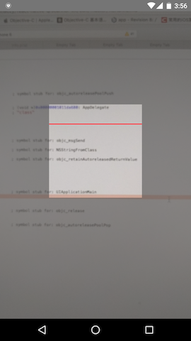

# react-native-qrscanner-kit

基于[react-native-camera](https://github.com/chinaczy/react-native-camera)

  增加扫描覆盖界面 ，扫描出结果后，不再继续解析二维码。通过调用shouldQR来再次开启继续解析二维码。
  
  
## Getting started
.
### Requirements
1. JDK >= 1.7 (if you run on 1.6 you will get an error on "_cameras = new HashMap<>();")
2. With iOS 10 and higher you need to add the "Privacy - Camera Usage Description" key to the info.plist of your project. This should be found in 'your_project/ios/your_project/Info.plist'.  Add the following code:
```
<key>NSCameraUsageDescription</key>
<string>Your message to user when the camera is accesseded for the first time</string>

<!-- Include this only if you are planning to use the camera roll -->
<key>NSPhotoLibraryUsageDescription</key>
<string>Your message to user when the photo library is accessed for the first time</string>

<!-- Include this only if you are planning to use the microphone for video recording -->
<key>NSMicrophoneUsageDescription</key>
<string>Your message to user when the microsphone is accessed for the first time</string>
```

### Mostly automatic install with react-native
1. `npm install react-native-camera@https://github.com/chinaczy/react-native-camera.git --save`
2. `npm install react-native-qrscanner-kit`
3. `react-native link react-native-camera`


### Manual install
#### iOS
1. `npm install react-native-camera@https://github.com/lwansbrough/react-native-camera.git --save`
2. In XCode, in the project navigator, right click `Libraries` ➜ `Add Files to [your project's name]`
3. Go to `node_modules` ➜ `react-native-camera` and add `RCTCamera.xcodeproj`
4. In XCode, in the project navigator, select your project. Add `libRCTCamera.a` to your project's `Build Phases` ➜ `Link Binary With Libraries`
5. Click `RCTCamera.xcodeproj` in the project navigator and go the `Build Settings` tab. Make sure 'All' is toggled on (instead of 'Basic'). In the `Search Paths` section, look for `Header Search Paths` and make sure it contains both `$(SRCROOT)/../../react-native/React` and `$(SRCROOT)/../../../React` - mark both as `recursive`.
5. Run your project (`Cmd+R`)


#### Android
1. `npm install react-native-camera@https://github.com/lwansbrough/react-native-camera.git --save`
2. Open up `android/app/src/main/java/[...]/MainApplication.java
  - Add `import com.lwansbrough.RCTCamera.RCTCameraPackage;` to the imports at the top of the file
  - Add `new RCTCameraPackage()` to the list returned by the `getPackages()` method. Add a comma to the previous item if there's already something there.

3. Append the following lines to `android/settings.gradle`:

	```
	include ':react-native-camera'
	project(':react-native-camera').projectDir = new File(rootProject.projectDir, 	'../node_modules/react-native-camera/android')
	```

4. Insert the following lines inside the dependencies block in `android/app/build.gradle`:

	```
    compile project(':react-native-camera')
	```


## Usage
```
import Scan from 'react-native-qrscanner-kit' ;
...
scanResult(data , callback){
    Alert.alert( "qrcode result " ,  data.data , [{text:"ok" , onPress:()=>callback()}],{cancelable:false}) ; 
  }
  render() {
    
    return (
      <View style={{flex:1 }}>
        <Scan
          
          onBarCodeRead={this.scanResult.bind(this)}
          />
        
      </View>
    );
  }
}
```
[more about Camera go to](https://github.com/chinaczy/react-native-camera)
